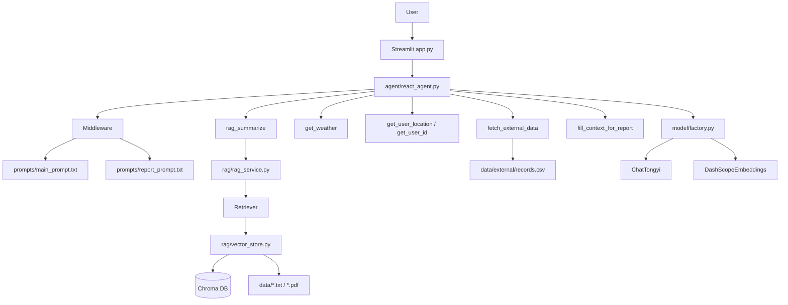

# SimpleAgent

[中文](#中文) | [English](#english)

## 中文

### 1. 项目简介

`SimpleAgent` 是一个基于 `LangChain + LangGraph + Chroma + Streamlit` 的轻量级 RAG Agent 示例项目。

它把三类能力组合在一起：

- `Agent`：负责理解用户意图、决定是否调用工具
- `RAG`：负责从本地知识库中检索相关内容并生成回答
- `业务工具`：负责天气、用户信息、外部记录查询、报表场景切换等辅助能力

这个项目适合用来学习一个最小可运行的 Agent + RAG 架构是如何拼起来的。

### 2. 快速开始

### 2.1 环境准备

建议使用 Python `3.10+`。

安装依赖：

```bash
pip install streamlit langchain langgraph langchain-chroma langchain-community langchain-text-splitters chromadb pypdf pyyaml dashscope
```

### 2.2 配置模型

项目默认读取阿里 DashScope 相关模型配置：

- 聊天模型：`config/rag_config.yaml`
- 向量模型：`config/rag_config.yaml`

你可以二选一配置 API Key：

1. 在环境变量中设置 `DASHSCOPE_API_KEY`
2. 或直接修改 [config/rag_config.yaml](/c:/Users/czhang30/Desktop/project/RAG/SimpleAgent/config/rag_config.yaml)

### 2.3 准备知识库

知识库默认目录：

- `data/`：RAG 文档
- `data/external/records.csv`：报表场景使用的外部业务数据

构建向量库：

```bash
python rag/vector_store.py
```

执行后会：

- 读取 `data/` 下的 `txt` 和 `pdf`
- 按 `config/chroma_config.yaml` 的切分参数分块
- 写入本地 Chroma 向量库
- 使用 `md5.txt` 避免重复索引同一文件

### 2.4 启动项目

启动 Web 对话界面：

```bash
streamlit run app.py
```

如果只想快速验证 RAG 链路：

```bash
python main.py
```

### 3. 使用方法

启动后可直接在聊天框输入问题，例如：

- 产品知识问答：`扫地机器人如何进行维护保养？`
- 故障排查：`机器人吸力变弱可能是什么原因？`
- 报表场景：`Generate my usage report`

系统会根据问题类型自动选择：

- 直接由模型回答
- 调用 `rag_summarize` 检索知识库
- 调用用户/天气/外部记录等工具
- 在报表模式下切换到专门的报告 Prompt

### 4. 原理与模块布局

### 4.1 整体流程

1. 用户通过 `Streamlit` 页面输入问题
2. `ReactAgent` 接收消息并驱动 Agent 推理
3. Agent 根据系统 Prompt 判断是否需要调用工具
4. 如果调用 `rag_summarize`，则进入 RAG 检索链路
5. 如果调用业务工具，则返回天气、用户信息或外部记录
6. 中间件负责日志记录、工具监控、Prompt 动态切换
7. 最终答案以流式方式返回给前端

### 4.2 结构图



### 4.3 模块职责

- [app.py](/c:/Users/czhang30/Desktop/project/RAG/SimpleAgent/app.py)
  Streamlit 对话入口，负责展示聊天记录和流式输出。
- [agent/react_agent.py](/c:/Users/czhang30/Desktop/project/RAG/SimpleAgent/agent/react_agent.py)
  创建 Agent，注册模型、工具和中间件。
- [agent/tools/agent_tools.py](/c:/Users/czhang30/Desktop/project/RAG/SimpleAgent/agent/tools/agent_tools.py)
  定义可被 Agent 调用的工具，包括 RAG 检索、天气、用户信息、外部记录查询等。
- [agent/tools/middle_ware.py](/c:/Users/czhang30/Desktop/project/RAG/SimpleAgent/agent/tools/middle_ware.py)
  负责工具调用监控、模型调用前日志、报表场景的动态 Prompt 切换。
- [rag/rag_service.py](/c:/Users/czhang30/Desktop/project/RAG/SimpleAgent/rag/rag_service.py)
  负责“检索 + Prompt 拼接 + LLM 总结生成”。
- [rag/vector_store.py](/c:/Users/czhang30/Desktop/project/RAG/SimpleAgent/rag/vector_store.py)
  负责文档加载、切分、向量化、写入 Chroma，以及生成 Retriever。
- [model/factory.py](/c:/Users/czhang30/Desktop/project/RAG/SimpleAgent/model/factory.py)
  统一创建聊天模型和向量模型。
- [utils/config_handler.py](/c:/Users/czhang30/Desktop/project/RAG/SimpleAgent/utils/config_handler.py)
  集中加载 YAML 配置。
- [utils/prompt_loader.py](/c:/Users/czhang30/Desktop/project/RAG/SimpleAgent/utils/prompt_loader.py)
  根据配置读取不同 Prompt 文件。

### 4.4 配置文件说明

- [config/rag_config.yaml](/c:/Users/czhang30/Desktop/project/RAG/SimpleAgent/config/rag_config.yaml)
  配置聊天模型、Embedding 模型和 API Key。
- [config/chroma_config.yaml](/c:/Users/czhang30/Desktop/project/RAG/SimpleAgent/config/chroma_config.yaml)
  配置向量库目录、检索条数、分块大小、重叠长度、可加载文件类型等。
- [config/prompt_config.yaml](/c:/Users/czhang30/Desktop/project/RAG/SimpleAgent/config/prompt_config.yaml)
  配置主 Prompt、RAG Prompt、报表 Prompt 的路径。
- [config/agent_config.yaml](/c:/Users/czhang30/Desktop/project/RAG/SimpleAgent/config/agent_config.yaml)
  配置外部业务数据文件路径。

### 5. 目录结构

```text
SimpleAgent/
|-- agent/
|   |-- react_agent.py
|   `-- tools/
|       |-- agent_tools.py
|       `-- middle_ware.py
|-- config/
|   |-- agent_config.yaml
|   |-- chroma_config.yaml
|   |-- prompt_config.yaml
|   `-- rag_config.yaml
|-- data/
|   |-- *.txt / *.pdf
|   `-- external/records.csv
|-- model/
|   `-- factory.py
|-- prompts/
|   |-- main_prompt.txt
|   |-- rag_summarize.txt
|   `-- report_prompt.txt
|-- rag/
|   |-- rag_service.py
|   `-- vector_store.py
|-- utils/
|   |-- config_handler.py
|   |-- file_handler.py
|   |-- logger_handler.py
|   |-- path_tool.py
|   `-- prompt_loader.py
|-- app.py
|-- main.py
`-- README.md
```

### 6. 当前实现特点

- 使用本地 Chroma 作为向量数据库，适合快速实验
- 知识库支持 `txt` 和 `pdf`
- 已包含报表场景的 Prompt 动态切换示例
- 业务工具部分目前有一定 mock 性质，便于后续替换成真实接口

### 7. 后续可扩展方向

- 增加真实天气 API、用户中心 API、业务数据库查询
- 为向量库构建过程增加增量更新与删除能力
- 增加 `requirements.txt` 或 `pyproject.toml`
- 为 Prompt、Tool、RAG 检索链路补充测试

---

## English

### 1. Overview

`SimpleAgent` is a lightweight RAG Agent demo built with `LangChain`, `LangGraph`, `Chroma`, and `Streamlit`.

It combines three layers:

- `Agent`: understands user intent and decides whether to call tools
- `RAG`: retrieves relevant local knowledge and generates grounded answers
- `Business tools`: provide weather, user info, external records, and report-mode context switching

This project is a compact example of how an Agent + RAG stack fits together.

### 2. Quick Start

### 2.1 Requirements

Use Python `3.10+`.

Install dependencies:

```bash
pip install streamlit langchain langgraph langchain-chroma langchain-community langchain-text-splitters chromadb pypdf pyyaml dashscope
```

### 2.2 Model Configuration

The project reads DashScope-related model settings from:

- [config/rag_config.yaml](/c:/Users/czhang30/Desktop/project/RAG/SimpleAgent/config/rag_config.yaml)

Configure the API key in either of these ways:

1. Set environment variable `DASHSCOPE_API_KEY`
2. Or write it directly into `config/rag_config.yaml`

### 2.3 Build the Knowledge Base

Default data locations:

- `data/`: RAG knowledge files
- `data/external/records.csv`: external business records for the report scenario

Build the vector store:

```bash
python rag/vector_store.py
```

This step will:

- read `txt` and `pdf` files from `data/`
- split documents using settings from `config/chroma_config.yaml`
- store vectors in local Chroma
- record file hashes in `md5.txt` to avoid duplicate indexing

### 2.4 Run the Project

Start the web UI:

```bash
streamlit run app.py
```

Run a quick RAG smoke test:

```bash
python main.py
```

### 3. Usage

After startup, ask questions in the chat UI, for example:

- knowledge QA: `How do I maintain the robot?`
- troubleshooting: `Why is the suction getting weaker?`
- report scenario: `Generate my usage report`

Depending on the query, the system may:

- answer directly with the model
- call `rag_summarize` for retrieval
- call user/weather/external-data tools
- switch to a dedicated report prompt when report mode is triggered

### 4. Architecture and Module Layout

### 4.1 End-to-End Flow

1. The user sends a message from the Streamlit UI.
2. `ReactAgent` receives the message and runs the agent loop.
3. The agent uses the system prompt to decide whether tools are needed.
4. If `rag_summarize` is selected, the request enters the RAG pipeline.
5. If business tools are selected, the agent fetches weather, user info, or external records.
6. Middleware handles logging, tool monitoring, and dynamic prompt switching.
7. The final answer is streamed back to the UI.

### 4.2 Structure Diagram


### 4.3 Module Responsibilities

- [app.py](/c:/Users/czhang30/Desktop/project/RAG/SimpleAgent/app.py)
  Streamlit chat entry, message rendering, and streaming output.
- [agent/react_agent.py](/c:/Users/czhang30/Desktop/project/RAG/SimpleAgent/agent/react_agent.py)
  Creates the agent and wires together model, tools, and middleware.
- [agent/tools/agent_tools.py](/c:/Users/czhang30/Desktop/project/RAG/SimpleAgent/agent/tools/agent_tools.py)
  Defines callable tools such as RAG retrieval, weather, user info, and external record lookup.
- [agent/tools/middle_ware.py](/c:/Users/czhang30/Desktop/project/RAG/SimpleAgent/agent/tools/middle_ware.py)
  Handles tool monitoring, pre-model logging, and dynamic prompt switching for report mode.
- [rag/rag_service.py](/c:/Users/czhang30/Desktop/project/RAG/SimpleAgent/rag/rag_service.py)
  Implements retrieval, prompt assembly, and LLM summarization.
- [rag/vector_store.py](/c:/Users/czhang30/Desktop/project/RAG/SimpleAgent/rag/vector_store.py)
  Loads documents, splits them, embeds them, writes to Chroma, and exposes a retriever.
- [model/factory.py](/c:/Users/czhang30/Desktop/project/RAG/SimpleAgent/model/factory.py)
  Centralized factory for chat and embedding models.
- [utils/config_handler.py](/c:/Users/czhang30/Desktop/project/RAG/SimpleAgent/utils/config_handler.py)
  Loads YAML configuration files.
- [utils/prompt_loader.py](/c:/Users/czhang30/Desktop/project/RAG/SimpleAgent/utils/prompt_loader.py)
  Reads prompt files based on config.

### 5. Project Tree

```text
SimpleAgent/
|-- agent/
|-- config/
|-- data/
|-- model/
|-- prompts/
|-- rag/
|-- utils/
|-- app.py
|-- main.py
`-- README.md
```

### 6. Notes

- Chroma is used as a local vector database for fast experimentation.
- The knowledge base currently supports `txt` and `pdf`.
- Report-mode prompt switching is already implemented through middleware.
- Some business tools are mock implementations and can be replaced with real services later.
